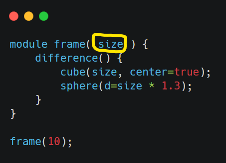

Module クラスについて
------------------------------------

制限があるものの、
[`OpenSCAD の Module <https://en.wikibooks.org/wiki/OpenSCAD_User_Manual/User-Defined_Functions_and_Modules#Modules>`_]
もサポートしています。

主な制限
================

モジュールのパラメーター (以下の OpenSCAD コードの黄色で囲った部分) を使うことができません。

使い方
=================

必要なライブラリを import

.. code-block::

    from decimal import Decimal
    from montyscad import monty_symbols as ms
    from montyscad import (
        Scad,
        Symbol,
        Module
    )

Module クラスから派生したモジュールを作成。Module クラスは Symbol クラスから派生しているので
append() で自分自身に子要素を追加します。

.. code-block::

    class frame(Module):
        def __init__(self):
            super().__init__()
            self.append(
                ms.difference()(
                    ms.cube(10, center=True),
                    ms.sphere(d=10 * Decimal('1.3'))
                )
            )

scad オブジェクトを作成し、作成したモジュールのオブジェクトを登録

.. code-block::

    scad = Scad()
    scad.append(frame())

登録したモジュールを呼び出し

.. code-block::

    scad.append(Symbol('frame'))

出力される OpenSCAD スクリプトは以下のようになります。

.. code-block::

    module frame() {
      difference() {
        cube(10, center=true);
        sphere(d=13.0);
      }
    }
    frame();
